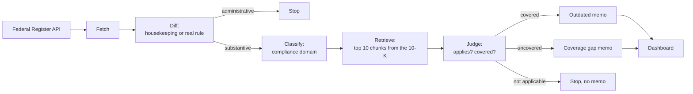
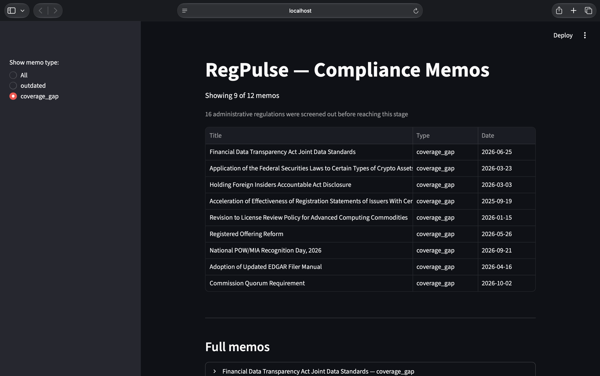
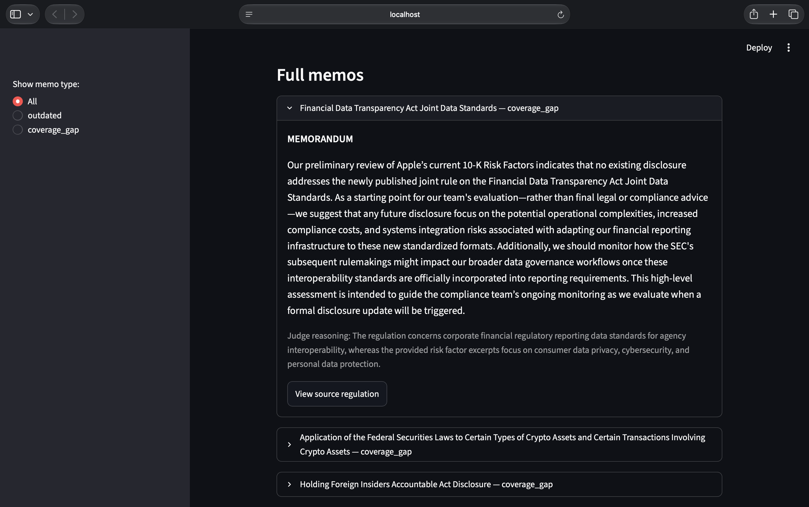
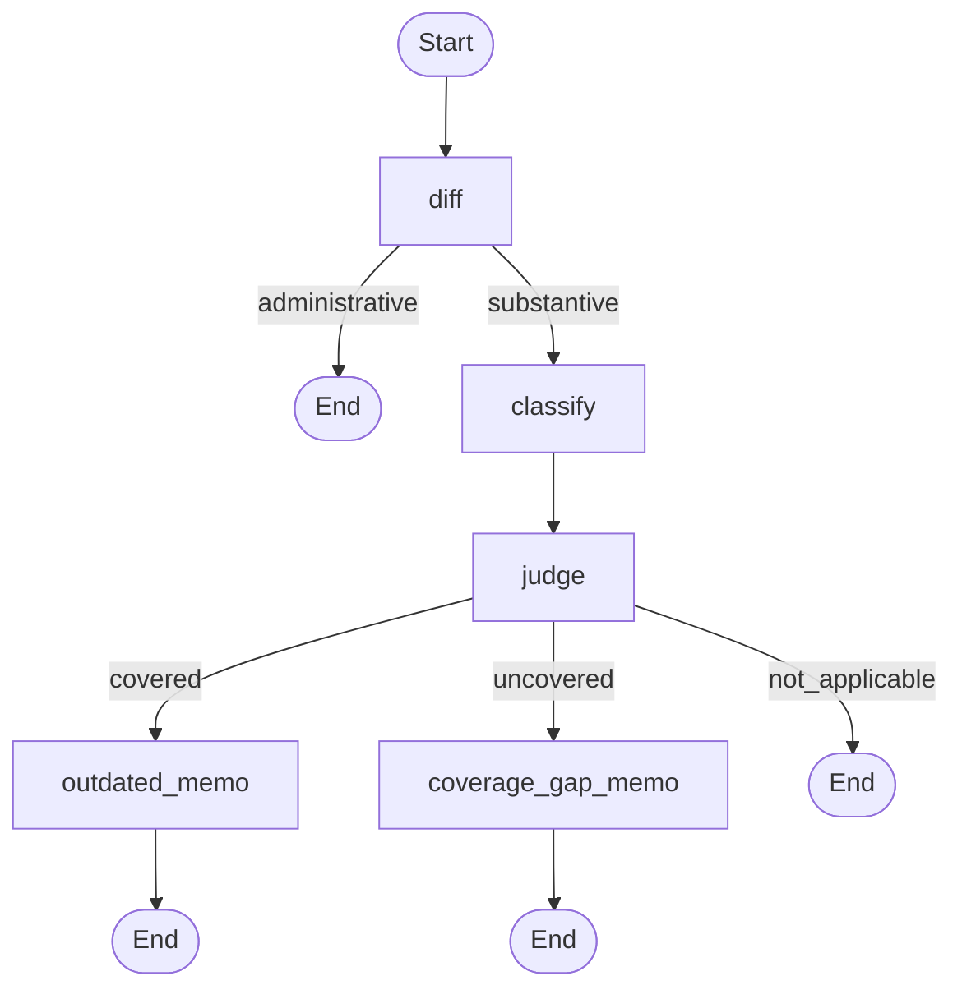

# RegPulse

[](https://github.com/d4t4forge-debugX/regpulse/actions/workflows/eval.yml)

**Regulatory change monitoring for compliance teams.** RegPulse watches for new rules in the Federal Register, decides whether each one actually applies to a company, checks it against the company's own public risk disclosures, and writes a short memo saying whether that language may now be outdated or is missing something.

Built end to end as a multi-stage pipeline: data ingestion, retrieval-augmented generation (RAG), an LLM-as-judge, graph orchestration, evaluation, scheduling, and a dashboard.

---

## Contents

1. [The problem](#1-the-problem)
2. [What RegPulse does](#2-what-regpulse-does)
3. [Key terms in plain language](#3-key-terms-in-plain-language)
4. [How it works](#4-how-it-works)
5. [A worked example](#5-a-worked-example)
6. [Design decisions and the evidence behind them](#6-design-decisions-and-the-evidence-behind-them)
7. [Evaluation](#7-evaluation)
8. [Tech stack](#8-tech-stack)
9. [Project structure](#9-project-structure)
10. [Getting started](#10-getting-started)
11. [Running RegPulse](#11-running-regpulse)
12. [Scheduling](#12-scheduling)
13. [Cost](#13-cost)
14. [Known limitations](#14-known-limitations)
15. [Lessons learned](#15-lessons-learned)
16. [Roadmap](#16-roadmap)
17. [License](#17-license)

---

## 1. The problem

Public companies describe their risks in their annual report (the 10-K). When regulators publish a new rule, some of that wording can quietly become out of date, or a new obligation may not be covered at all.

Today, spotting this means someone reading each new regulation, deciding whether it even applies, and cross-referencing it by hand against the company's filings. It is slow, easy to miss, and hard to repeat consistently.

## 2. What RegPulse does

1. **Pulls** new rules from the Federal Register.
2. **Filters out** the agency's routine housekeeping (technical amendments, delegations, compliance-date extensions, filing-manual updates) so only real rules continue.
3. **Tags** each remaining rule by compliance domain (for example data privacy or market regulation).
4. **Searches** the company's 10-K Risk Factors for the passages closest to the rule.
5. **Judges** with an LLM, in two steps: does this rule materially affect the company at all, and if so, does any retrieved passage already discuss that risk? The judge explains its verdict.
6. **Acts on the verdict:**
   - **Covered:** a passage discusses the risk, so an **outdated** memo flags that it may need updating.
   - **Uncovered:** the rule affects the company but no passage discusses it, so a **coverage gap** memo flags it.
   - **Not applicable:** the rule does not affect the company, so **no memo** is written.
7. **Shows the results** in a dashboard, with the judge's reasoning and a link back to the source regulation.

The reference company in this project is **Apple**. Its real 10-K Risk Factors stand in for a company's "internal policy", because they are real, messy, and free to use. Every company-specific value lives in `config.py`, so the same pipeline can be pointed at another company.

## 3. Key terms in plain language

| Term | Meaning |
|---|---|
| **SEC** | The US Securities and Exchange Commission, which regulates public companies. |
| **Federal Register** | The US government's daily publication of new rules and notices. It has a free public API. |
| **10-K** | A public company's annual report to the SEC. |
| **Risk Factors (Item 1A)** | The section of the 10-K where a company lists the risks to its business. RegPulse compares rules against this section. |
| **Embedding** | A list of numbers that captures the meaning of a piece of text, so similar texts end up close together. |
| **Chunk** | A small slice of a long document (here, 500 characters) so it can be searched piece by piece. |
| **Vector store (Chroma)** | A database that finds the chunks whose embeddings are closest to a query. |
| **RAG** | Retrieval-augmented generation: find relevant text first, then let a language model reason over it. |
| **LLM-as-judge** | Using a language model to make a structured decision, here: "does this rule apply, and is it already covered?" |
| **Zero-shot classification** | Tagging text with labels the model was never specifically trained on. |
| **Distance** | How far apart two embeddings are. Lower means more similar. |
| **Confusion matrix** | A grid of expected answers (rows) against the system's answers (columns). Correct answers sit on the diagonal; every off-diagonal number is a specific kind of mistake. |

## 4. How it works

### Pipeline overview



### Stage by stage

The whole pipeline is two commands: fetch, then the graph. The graph runs every stage after fetching, one regulation at a time.

| # | Stage | File | What it does |
|---|---|---|---|
| 1 | Fetch | `ingestion/fetch_federal_register.py` | Pulls final rules from the agencies listed in `config.py` (currently the SEC) for the last 365 days, and merges them into `federal_register_docs.json`. |
| 2 | Diff | `pipeline/diff_agent.py` | Marks each document administrative or substantive by matching its title and abstract against a phrase list of agency housekeeping. |
| 3 | Classify | `pipeline/classify_agent.py` | Zero-shot tags each substantive document with one of 9 compliance domains, with a confidence score. Shown for context; it does not change routing. |
| 4 | Retrieve and judge | `pipeline/retrieval_agent.py` | Finds the 10 closest chunks of the Risk Factors, then asks Gemini for a verdict (`covered`, `uncovered` or `not_applicable`), the chunk it relied on, and its reasoning. |
| 5 | Memo | `pipeline/impact_agent.py` | Writes an outdated or coverage-gap memo with Gemini. Not-applicable rules get none. |
| 6 | Graph | `pipeline/graph.py` | Wires stages 2 to 5 into a LangGraph workflow, one run per regulation. |
| 7 | Batch runner | `pipeline/run_graph.py` | Loops over all documents, skips ones already done, saves after each one to `graph_results.json`. |
| 8 | Dashboard | `app/streamlit_app.py` | Shows memos with filtering, judge reasoning, and source links. |

### The dashboard

The Streamlit dashboard lists every memo the pipeline has written. The sidebar filters by memo type, and a caption shows how many regulations were screened out as administrative and how many were judged not applicable.



Each memo expands to show its text, the judge's reasoning, and a link to the source regulation.



### The retrieval design

The Risk Factors text is split into **500-character chunks with a 50-character overlap**, embedded with `all-MiniLM-L6-v2`, and stored in a local Chroma collection (151 chunks for Apple). For each regulation, the title and abstract become the query. The **10 closest chunks** are passed to the Gemini judge, which returns:

- `verdict`: `covered`, `uncovered` or `not_applicable`
- `relevant_chunk_number`: which of the 10 chunks it relied on (only for `covered`)
- `reasoning`: a short explanation

### The orchestration graph

Each regulation runs through the graph once. The loop over regulations sits outside the graph, which keeps skipping and saving simple.



The zero-shot classifier and the embedding model are loaded once and reused for every regulation, not reloaded per document.

### Data flow and keys

Every data file is keyed by the Federal Register `document_number`, and every save **merges** into the existing file by that key. Nothing is overwritten wholesale, so no run can shrink a file another step depends on.

## 5. A worked example

These are real results from the current data (31 documents: 17 administrative, 9 not applicable, 5 memos).

**Children's Online Privacy Protection Rule** (`2025-05904`)

1. **Diff:** substantive.
2. **Classify:** "Data privacy and cybersecurity", a weak fit (score 0.25, gap 0.02 over the next label).
3. **Retrieve:** the closest Risk Factors chunk has distance 1.055.
4. **Judge:** `covered`. The matched passage says Apple is subject to specific obligations on collecting and processing data associated with minors.
5. **Memo:** an **outdated** memo, saying that general disclosure may need to reflect the FTC's finalized amendments.

Notice step 3. A distance of 1.055 looks weak: it sits inside the range of the irrelevant documents. Judging by distance alone would have missed this rule. The judge read the text and got it right (see the next section).

**Achieving 100% Wireless Handset Model Hearing Aid Compatibility** (`2024-25088`, FCC)

Every iPhone model sold in the US must comply, but Apple's Risk Factors never mention hearing-aid compatibility. The judge returns `uncovered` ("materially affects Apple as a manufacturer of wireless handsets, [but] none of the retrieved excerpts discuss ... hearing aid compatibility"), and RegPulse writes a **coverage gap** memo.

**National POW/MIA Recognition Day, 2026** (`2026-19334`)

A ceremonial presidential proclamation with no abstract. RegPulse falls back to the title alone, and the judge returns `not_applicable` (distance 1.772, the farthest of all). No memo is written.

## 6. Design decisions and the evidence behind them

**Decide applicability before coverage.** The first judge answered only "is any passage relevant?", and every "no" became a coverage-gap memo. That produced memos for rules that have nothing to do with Apple, such as a POW/MIA proclamation and EDGAR filing-manual updates: 10 of 13 memos. The judge now returns three verdicts, and its prompt asks "does this materially affect Apple?" **before** "is it covered?". When the prompt only listed the three definitions, the hard BIS export-control case still came back `covered`, because Apple's trade risk factor mentions export controls. Ordering the two questions fixed it ("Apple is not a manufacturer or exporter of these enterprise AI chips") without breaking the real `covered` cases. Memos went from 13 to 5, and every remaining one is for a rule that affects Apple.

**An LLM judge instead of a distance threshold.** The obvious approach is "if the closest chunk is within X, call it relevant". It failed: the closest irrelevant regulation scored nearer than a relevant one, and COPPA landed inside the irrelevant range. No single cutoff separates the classes, so the judge decides from meaning.

**A written rule for the diff step.** Administrative means the agency's routine housekeeping on itself: its own procedures, staff delegations, forms, filing system and dates. Everything else is substantive, even if it has nothing to do with the company, because applicability is the judge's job. The keyword list follows that rule. It is not stretched to catch one-off titles just to raise the score.

**`temperature=0` on the judge.** The hardest positive case (customs import disclosures) returned true on one run and false on the next with identical input. Setting the temperature to 0 made the verdict stable, and later reruns matched.

**Official metadata only.** Two documents once carried hand-paraphrased abstracts instead of the official text. They were replaced with the Federal Register's own metadata, and `ingestion/refresh_documents.py` re-fetches any document by number when its data is in doubt.

**Title-only fallback for missing abstracts.** In an unlabeled sample of 20 real documents, 7 (35%) had no abstract. Skipping them would have hidden a whole category of documents, such as presidential proclamations, some of which matter. The pipeline uses the title instead, and it works end to end.

**Merge by key everywhere.** An early version overwrote data files on each run. That silently shrank three files and dropped documents the fetch step could not return again. Every save now loads, merges by `document_number`, and writes.

**One pipeline, one config file.** An older run-each-script-by-hand path wrote its own output files alongside the LangGraph runner. It was removed, so cron runs exactly two steps (fetch, then the graph). Company-specific values (name, CIK, filing files, Chroma collection, agencies, domain labels, model) live in `config.py`.

**Text retrieval only, ColQwen2 parked.** A visual retriever (ColQwen2) was built and tested as a second candidate source. It ranked the right pages highly, but page-level retrieval over the 12 risk-factor pages is coarse: a few "hub" pages filled most top-3 slots for every query, relevant or not, and its scores cannot be compared across queries or against text distances. It also can only rank, so it cannot say "nothing is relevant". It stays a standalone experiment (`vectorstore/colpali_store.py`, `eval/colpali_*.py`), working from a frozen snapshot in `federal_register_retrieval.json`.

**One model per verdict.** A cheaper Gemini variant got the hard BIS case wrong where the full model got it right. The pipeline does not route documents to whichever model has quota left, because that would make verdicts depend on timing instead of content.

**Cron for scheduling.** Cron is built into macOS and needs no long-running process, unlike a Python scheduler library.

## 7. Evaluation

Two evaluations run from `eval/run_eval.py`, each against hand-labeled gold sets. Labels are written and committed **before** the pipeline sees a new document, so the git history shows they were not adjusted after the fact.

| Evaluation | Tests | Gold set | Result | Gemini cost |
|---|---|---|---|---|
| Judge | Is the 3-way verdict right? | `eval/gold_set.json`, 12 documents (3 covered, 2 uncovered, 7 not applicable) | **11/12** | 0 by default, uses Gemini with `--rerun` |
| Diff | Administrative or substantive? | `eval/gold_set_diff.json`, 31 documents | **30/31 (96.77%)** | 0 |

The judge evaluation prints a confusion matrix:

```
                         covered       uncovered  not_applicable
covered                        3               0               0
uncovered                      1               1               0
not_applicable                 0               0               7
```

**The two misses, and why they were not "fixed".**

- **Judge: button-battery products** (`2023-20333`, CPSC). It applies to AirTag, and the Risk Factors never mention button or coin batteries, so it was labeled `uncovered`. The judge called it `covered`, pointing at a generic catch-all line ("environmental, health and safety, including ... product design and climate change"). This was predicted as a hard case before the run. The impact is small, because both verdicts produce a memo, and the memo itself notes the disclosure is only general. Tuning the prompt against this exact example would make the score meaningless; a fix needs new blind-labeled cases to test against.
- **Diff: Commission Quorum Requirement** (`2026-20262`). It is SEC housekeeping on its own voting rules, so it was labeled administrative. No phrase in the list catches it, and adding "Quorum" would match only this one document. It reaches the judge, which correctly returns `not_applicable`, so it costs one Gemini call and produces no memo.

**How much to trust these numbers.**

- A perfect score is treated as a prompt to stress-test, not as proof. The judge first scored 10/10 with no `uncovered` example in the gold set at all, which tested nothing about the coverage-gap path. Two blind-labeled `uncovered` cases were added, and one of them failed.
- The gold set includes deliberately hard cases: BIS license review (topically close to a real risk factor, but not applicable), the CBP customs disclosure (covered, with no tariff vocabulary), and the button-battery rule (generic catch-all text nearby).
- 12 judge examples is a small set, and 2 of the 7 not-applicable labels are marked borderline in the file. Growing the gold sets with blind-labeled documents is the main evaluation to-do.

**Evaluations fail loudly.** If any gold document is missing from the data, or was judged before the 3-way judge existed, the evaluation lists every affected document and exits with code 1. It never prints a score over a partial or outdated set. This came from a real bug: a damaged data file once made the diff evaluation print 62.96% over skipped examples.

## 8. Tech stack

| Purpose | Tool |
|---|---|
| Language model (judge and memos) | Gemini API, `gemini-3.5-flash` |
| Orchestration | LangGraph |
| Embeddings | sentence-transformers, `all-MiniLM-L6-v2` (runs locally) |
| Vector store | Chroma (local, no server) |
| Zero-shot classification | Hugging Face `transformers`, `facebook/bart-large-mnli` |
| Tracing | LangSmith (free tier) |
| Dashboard | Streamlit |
| Scheduling | cron |
| CI | GitHub Actions (runs both evaluations on every push) |
| Data sources | Federal Register API (no key needed), SEC EDGAR |
| Visual retrieval (experimental) | ColQwen2, `vidore/colqwen2-v1.0-hf` |

## 9. Project structure

```
Regpulse/
├── config.py                        # company-specific settings (name, CIK, files, agencies, labels, model)
├── ingestion/
│   ├── fetch_federal_register.py    # rules from the Federal Register API
│   ├── refresh_documents.py         # re-fetch official metadata for given document numbers
│   ├── fetch_sec_edgar.py           # the company's 10-K from SEC EDGAR
│   ├── extract_risk_factors.py      # pulls the Risk Factors section out of the 10-K
│   ├── html_to_pdf.py               # 10-K to PDF (ColQwen2 experiment)
│   └── pdf_to_images.py             # PDF to page images (ColQwen2 experiment)
├── pipeline/
│   ├── diff_agent.py                # administrative vs substantive
│   ├── classify_agent.py            # compliance-domain tagging
│   ├── retrieval_agent.py           # retrieval plus the 3-way Gemini judge
│   ├── impact_agent.py              # memo generation and memo routing
│   ├── graph.py                     # LangGraph workflow
│   └── run_graph.py                 # batch runner
├── vectorstore/
│   ├── chroma_store.py              # builds and loads the Chroma collection
│   └── colpali_store.py             # ColQwen2 page ranking (experiment)
├── eval/
│   ├── run_eval.py                  # judge and diff evaluations
│   ├── gold_set.json                # 12 labeled documents (judge)
│   └── gold_set_diff.json           # 31 labeled documents (diff)
├── app/
│   └── streamlit_app.py             # dashboard
├── scripts/
│   └── run_pipeline.sh              # fetch, then graph (used by cron)
├── apple_risk_factors_clean.txt     # source text for the vector store
├── federal_register_docs.json       # every fetched regulation
├── graph_results.json               # final results, read by the dashboard and the evaluations
├── requirements.txt
└── .env.example
```

The `eval/` folder also holds a few one-off analysis scripts used during development (ColQwen2 comparisons, an unlabeled smoke test, a Federal Register keyword browser for finding gold-set candidates).

## 10. Getting started

**Requirements:** a recent Python 3, a Gemini API key, and about 2 GB of disk for the virtual environment and downloaded models. Developed on macOS (Apple Silicon).

```
git clone https://github.com/d4t4forge-debugX/regpulse.git
cd regpulse
python3 -m venv .venv
source .venv/bin/activate
pip install -r requirements.txt
cp .env.example .env
```

Open `.env` and fill in your keys:

```
GEMINI_API_KEY=your-gemini-api-key-here
LANGSMITH_TRACING=true
LANGSMITH_API_KEY=your-langsmith-api-key-here
LANGSMITH_PROJECT=regpulse
```

LangSmith is optional tracing; set `LANGSMITH_TRACING=false` to skip it.

Build the vector store **once**. It reads the Risk Factors text file named in `config.py`, so that file must stay in the project root:

```
python -m vectorstore.chroma_store
```

Do not run this again on an existing collection: it adds chunks with fixed IDs rather than replacing them. To point RegPulse at another company, set its values in `config.py` and use a new collection name.

The first run downloads the Hugging Face models (the zero-shot model is over 1 GB), so it takes a while.

**Optional:** the ColQwen2 visual-retrieval experiment needs a few extra packages. Install them with `pip install -r requirements-colpali.txt`, then run `playwright install chromium`. The main pipeline, dashboard and evaluations do not need them.

## 11. Running RegPulse

Run everything from the project root, as modules.

```
./scripts/run_pipeline.sh            # full pipeline: fetch, then graph
python -m pipeline.run_graph         # graph only; skips documents already processed
python -m pipeline.run_graph --all   # reprocess every document
streamlit run app/streamlit_app.py   # open the dashboard
```

Each pipeline run writes a timestamped log to `logs/`. The pipeline is safe to re-run: it merges new documents into the existing files and skips work already done.

Add specific documents by number (for example to label a new gold-set case):

```
python -m ingestion.refresh_documents 2024-25088 2023-20333
```

Run the evaluations:

```
python -m eval.run_eval              # judge evaluation on saved results (0 Gemini calls)
python -m eval.run_eval --rerun      # re-run the judge on the gold set (uses Gemini)
python -m eval.run_eval --diff       # diff evaluation (0 Gemini calls)
```

## 12. Scheduling

Cron runs the pipeline on weekdays at 11:30:

```
30 11 * * 1-5 /path/to/Regpulse/scripts/run_pipeline.sh >> /path/to/Regpulse/logs/cron.log 2>&1
```

Add it with `crontab -e`, using your real absolute paths. Why weekdays: the Federal Register publishes on weekdays, and SEC rules are infrequent (19 in the last 365 days).

Things to know:

- `run_pipeline.sh` calls `.venv/bin/python` by path and does its own `cd`, because cron does not load your shell startup files.
- The `>> logs/cron.log 2>&1` part captures launch errors (bad path, permissions) that the pipeline's own logs cannot.
- On macOS, a project under `~/Desktop` needs Full Disk Access granted to `/usr/sbin/cron`, or the job fails with "Operation not permitted".
- **Cron does not run while the machine is asleep or shut down, and it does not catch up afterwards.** A missed 11:30 run is skipped.
- When a run adds a new rule, the data files change. Commit them as a `Data:` commit, since CI evaluates the committed files.

To check a run afterwards:

```
ls -t logs | head -3 && cat logs/cron.log
```

A healthy run leaves a `pipeline_<date>_11-30-...` log and an empty `cron.log`.

## 13. Cost

A normal scheduled run makes **0 Gemini calls**: it skips every document already processed. A new substantive rule costs one call to judge it, plus one to write a memo if it is covered or uncovered. A not-applicable rule costs only the judge call.

The Gemini free tier proved too small for this project (about 20 requests per day per model, with per-minute limits as well), so it runs on a billed account. Everything else, including embeddings, the vector store, and zero-shot classification, runs locally for free.

## 14. Known limitations

- **The judge can mistake a generic catch-all for coverage.** One sentence listing broad categories of law ("environmental, health and safety, including ... product design") led the judge to call the button-battery rule `covered` (see Evaluation).
- **The judge sees only the 10 closest chunks**, about 7% of the Risk Factors. An `uncovered` verdict means none of those passages discusses the risk, not that no line of the 10-K does. The coverage-gap memo says so.
- **The diff step is keyword matching.** It misses one-off housekeeping titles such as the Commission Quorum Requirement. Those reach the judge, which returns `not_applicable`, so the cost is one Gemini call, not a wrong memo.
- **The evaluations are small.** 12 judge examples and 31 diff examples give wide uncertainty, and 2 judge labels are marked borderline.
- **Fetching covers SEC rules only.** The 7 non-SEC documents (FTC, FCC, CPSC, CBP, BIS and two presidential proclamations) were added by hand for evaluation.
- **One company at a time.** `config.py` holds one company's settings.
- **The 10-K is not refreshed automatically.** `fetch_sec_edgar.py` reuses the local copy once it exists, so a new annual filing has to be fetched deliberately.
- **Cron needs the machine awake** at run time.
- **Retrieval is text-only.** The vector store holds Risk Factors as plain chunks with no page metadata.
- **Memo quality is not scored.** The evaluations check verdicts, not the wording of memos, which are read by hand. Memos are drafted by an LLM and can overreach or extrapolate beyond the regulation's abstract. Treat them as starting points for a human reviewer, as each memo itself says.

## 15. Lessons learned

- **Check what the evaluation actually reads.** The judge evaluation once scored a stale side file instead of the pipeline's real output, so a perfect score said nothing about the system in use.
- **"Not relevant" is not the same as "missing".** Treating every non-match as a coverage gap filled the dashboard with memos about rules that do not apply.
- **A 100% score is a prompt to stress-test.** Ask what the check could not have caught. Here, an empty row in the confusion matrix meant a whole path was untested.
- **Do not tune on the example you are grading.** A known miss, explained, is worth more than a score bought by fitting the prompt to one case.
- **Check where every data field came from.** Two abstracts in the corpus were paraphrases, not official text, and the judge had been reasoning over them.
- **Merge by key, never overwrite.** Three overwrite-style saves once silently shrank data files.
- **Fail loudly, not partially.** A score printed over a partial set is worse than an error.
- **Pin `temperature=0` on judges.** Otherwise borderline verdicts can flip between runs.
- **Real data has missing fields.** About a third of unlabeled documents had no abstract, and a fallback beat skipping them.
- **A model name is not a billing status.** A long stretch of quota errors was a closed billing account, not a code bug. Check the real quota table.
- **Failed retries still count against quota.** More retries can hit the daily limit faster.
- **Save progress incrementally** in long LLM runs, so a failure does not lose finished work.
- **Cron has its own environment and its own OS permissions.**
- **Verify the notes against the files.** Project notes go stale; always check real state.

## 16. Roadmap

- [x] Ingestion, text RAG, diff and classification agents
- [x] LLM-as-judge retrieval and memo generation
- [x] LangGraph orchestration and batch runner
- [x] Evaluation harness with fail-loud checks
- [x] Streamlit dashboard
- [x] Scheduled runs with cron
- [x] CI: run the evaluations on every change (GitHub Actions)
- [x] 3-way judge verdict (covered / uncovered / not applicable)
- [x] Company settings in one config file
- [ ] Energy-utility version on its own branch
- [ ] Human-review flag for borderline verdicts
- [ ] Larger gold sets, labeled blind before running the pipeline
- [ ] Broader fetching beyond SEC rules
- [ ] Docker packaging (optional)
- [ ] Revisit visual retrieval for scanned or table-heavy filings

## 17. License

MIT. See [LICENSE](LICENSE).
