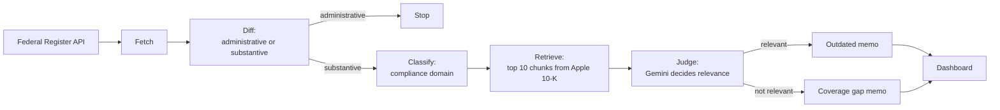
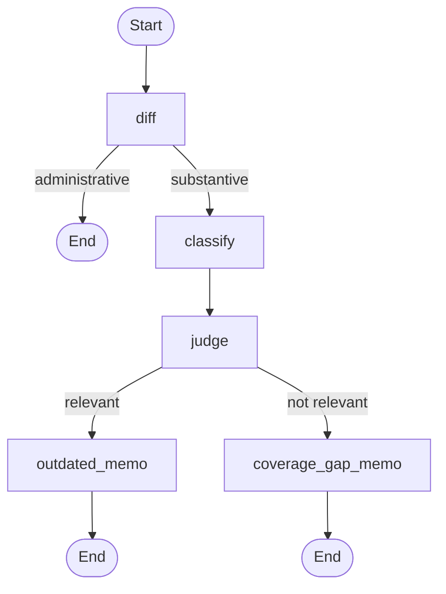

# RegPulse

**Regulatory change monitoring for compliance teams.** RegPulse watches for new SEC rules, checks them against a company's own public risk disclosures, and writes a short memo saying whether that language may now be outdated or is missing something.

Built end to end as a multi-stage pipeline: data ingestion, retrieval-augmented generation (RAG), an LLM-as-judge, graph orchestration, evaluation, scheduling, and a dashboard.

---

## Contents

1. [The problem](#1-the-problem)
2. [What RegPulse does](#2-what-regpulse-does)
3. [Key terms in plain language](#3-key-terms-in-plain-language)
4. [How it works](#4-how-it-works)
5. [A worked example](#5-a-worked-example)
6. [Design decisions and the evidence behind them](#6-design-decisions-and-the-evidence-behind-them)
7. [Evaluation](#7-evaluation)
8. [Tech stack](#8-tech-stack)
9. [Project structure](#9-project-structure)
10. [Getting started](#10-getting-started)
11. [Running RegPulse](#11-running-regpulse)
12. [Scheduling](#12-scheduling)
13. [Cost](#13-cost)
14. [Known limitations](#14-known-limitations)
15. [Lessons learned](#15-lessons-learned)
16. [Roadmap](#16-roadmap)

---

## 1. The problem

Public companies describe their risks in their annual report (the 10-K). When regulators publish a new rule, some of that wording can quietly become out of date, or a new obligation may not be covered at all.

Today, spotting this means someone reading each new regulation and cross-referencing it by hand against the company's filings. It is slow, easy to miss, and hard to repeat consistently.

## 2. What RegPulse does

1. **Pulls** new SEC rules from the Federal Register.
2. **Filters out** routine or administrative changes so only substantive rules continue.
3. **Tags** each substantive rule by compliance domain (for example data privacy or market regulation).
4. **Searches** the company's 10-K Risk Factors for passages related to the rule.
5. **Judges** with an LLM whether any retrieved passage is genuinely relevant, and explains why.
6. **Writes a memo** for each rule, in one of two types:
   - **Outdated:** a relevant passage exists, and it may need updating in light of the new rule.
   - **Coverage gap:** no passage addresses the rule.
7. **Shows the results** in a dashboard, with a link back to the source regulation and the judge's reasoning.

The reference company in this project is **Apple**. Its real 10-K Risk Factors stand in for a company's "internal policy", because they are real, messy, and free to use. The same design applies to any company's filing.

## 3. Key terms in plain language

| Term | Meaning |
|---|---|
| **SEC** | The US Securities and Exchange Commission, which regulates public companies. |
| **Federal Register** | The US government's daily publication of new rules and notices. It has a free public API. |
| **10-K** | A public company's annual report to the SEC. |
| **Risk Factors (Item 1A)** | The section of the 10-K where a company lists the risks to its business. RegPulse compares rules against this section. |
| **Embedding** | A list of numbers that captures the meaning of a piece of text, so similar texts end up close together. |
| **Chunk** | A small slice of a long document (here, 500 characters) so it can be searched piece by piece. |
| **Vector store (Chroma)** | A database that finds the chunks whose embeddings are closest to a query. |
| **RAG** | Retrieval-augmented generation: find relevant text first, then let a language model reason over it. |
| **LLM-as-judge** | Using a language model to make a yes/no decision, here: "is this passage really relevant to this rule?" |
| **Zero-shot classification** | Tagging text with labels the model was never specifically trained on. |
| **Distance** | How far apart two embeddings are. Lower means more similar. |

## 4. How it works

### Pipeline overview



### Stage by stage

| # | Stage | File | What it does | Output |
|---|---|---|---|---|
| 1 | Fetch | `ingestion/fetch_federal_register.py` | Pulls SEC rule documents from the last 365 days. | `federal_register_docs.json` |
| 2 | Diff | `pipeline/diff_agent.py` | Marks each document administrative or substantive by matching its title and abstract against a phrase list (for example technical amendments). | `federal_register_classified.json` |
| 3 | Classify | `pipeline/classify_agent.py` | Zero-shot tags each substantive document with one of 9 compliance domains, with a confidence score. | `federal_register_domains.json` |
| 4 | Retrieve and judge | `pipeline/retrieval_agent.py` | Finds the 10 closest chunks of Apple's Risk Factors, then asks Gemini whether any is truly relevant. Returns a verdict, the chunk number, and the reasoning. | `federal_register_retrieval.json` |
| 5 | Impact | `pipeline/impact_agent.py` | Writes the memo (outdated or coverage gap) with Gemini. | `coverage_gap_memos.json` |
| 6 | Graph | `pipeline/graph.py` | Wires stages 2 to 5 into a LangGraph workflow, one run per regulation. | (in memory) |
| 7 | Batch runner | `pipeline/run_graph.py` | Loops over all documents, skips ones already done, saves after each. | `graph_results.json` |
| 8 | Dashboard | `app/streamlit_app.py` | Shows memos with filtering, judge reasoning, and source links. | (browser) |

### The retrieval design

Apple's Risk Factors text is split into **500-character chunks with a 50-character overlap**, embedded with `all-MiniLM-L6-v2`, and stored in a local Chroma collection named `apple_risk_factors`. For each regulation, the title and abstract become the query. The **10 closest chunks** are passed to the Gemini judge, which returns:

- `is_relevant`: true or false
- `relevant_chunk_number`: which of the 10 chunks it relied on
- `reasoning`: a short explanation

### The orchestration graph

Each regulation runs through the graph once. The loop over regulations sits outside the graph, which keeps skipping and saving simple.



The zero-shot classifier and the embedding model are loaded once and reused for every regulation, not reloaded per document.

### Data flow and keys

Every data file is keyed by the Federal Register `document_number`, and every save **merges** into the existing file by that key. Nothing is overwritten wholesale, so no stage can shrink a file another stage depends on.

## 5. A worked example

These are real results from the current data.

**Children's Online Privacy Protection Rule** (`2025-05904`)

1. **Diff:** substantive.
2. **Classify:** "Data privacy and cybersecurity", a weak fit (score 0.25, gap 0.02 over the next label).
3. **Retrieve:** the closest Apple Risk Factors chunk has distance 1.055.
4. **Judge:** relevant. The matched passage says the company is subject to new and changing online-safety laws, including enhanced protections for minors.
5. **Memo:** an **outdated** memo, saying that generic disclosure may need to reflect the FTC's finalized amendments.

Notice step 3. A distance of 1.055 looks weak: it sits inside the range of the irrelevant documents (1.048 to 1.368). Judging by distance alone would have missed this rule. The judge read the text and got it right (see the next section).

**Adoption of Updated EDGAR Filer Manual** (`2026-07474`)

The rule is substantive on its face, but its closest chunk (distance 1.368) has nothing to do with it. The judge says not relevant, and the memo is a **coverage gap**.

**National POW/MIA Recognition Day, 2026** (`2026-19334`)

A ceremonial presidential proclamation with no abstract. RegPulse falls back to the title alone, the judge says not relevant (distance 1.772, the farthest of all), and the memo hedges appropriately instead of inventing a connection.

## 6. Design decisions and the evidence behind them

**An LLM judge instead of a distance threshold.** The obvious approach is "if the closest chunk is within X, call it relevant". It failed: the closest irrelevant regulation scored nearer than a relevant one, and COPPA landed inside the irrelevant range. No single cutoff separates the classes, so the judge decides from meaning.

**`temperature=0` on the judge.** The hardest positive case (customs import disclosures) returned true on one run and false on the next with identical input. Setting the temperature to 0 made the verdict stable, and later reruns matched.

**Title-only fallback for missing abstracts.** In an unlabeled sample of 20 real documents, 7 (35%) had no abstract. Skipping them would have hidden a whole category of documents, such as presidential proclamations, some of which matter. The pipeline uses the title instead, and it works end to end.

**Merge by key everywhere.** An early version overwrote data files on each run. That silently shrank three files and dropped documents the fetch step could not return again. Every save now loads, merges by `document_number`, and writes.

**Text retrieval only, ColQwen2 parked.** A visual retriever (ColQwen2) was built and tested as a second candidate source. It ranked the right pages highly, but page-level retrieval over the 12 risk-factor pages is coarse: a few "hub" pages filled most top-3 slots for every query, relevant or not, and its scores cannot be compared across queries or against text distances. It also can only rank, so it cannot say "nothing is relevant". It stays a standalone experiment (`vectorstore/colpali_store.py`, `eval/colpali_*.py`).

**One model per verdict.** A cheaper Gemini variant got the hard BIS case wrong where the full model got it right. The pipeline does not route documents to whichever model has quota left, because that would make verdicts depend on timing instead of content.

**Cron for scheduling.** Cron is built into macOS and needs no long-running process, unlike a Python scheduler library.

## 7. Evaluation

Two evaluations run from `eval/run_eval.py`, each against hand-labeled gold sets.

| Evaluation | Tests | Gold set | Result | Gemini cost |
|---|---|---|---|---|
| Judge | Is the retrieval verdict right? | `eval/gold_set.json`, 11 documents (3 relevant, 8 not) | **11/11** (0 false positives, 0 false negatives) | 0 by default, uses Gemini with `--rerun` |
| Diff | Administrative or substantive? | `eval/gold_set_diff.json`, 27 documents | **26/27 (96.30%)** | 0 |

**How much to trust these numbers.** A perfect score is treated as a prompt to stress-test, not as proof:

- The gold set includes deliberately hard cases: BIS license review (topically close to a real risk factor, but not relevant) and the CBP customs disclosure (relevant, with no tariff vocabulary).
- The judge was also run on 20 unlabeled documents from many agencies: no false positives. That batch had no true positives, so it says nothing about recall.
- With only 3 relevant examples in 11, the judge result is a **weak signal**. Growing the gold sets with documents labeled before seeing pipeline output is the main evaluation to-do.

**Evaluations fail loudly.** If any gold document is missing from the data, the evaluation lists every missing document and exits with code 1. It never prints a score over a partial set. This came from a real bug: a damaged data file once made the diff evaluation print 62.96% over skipped examples.

## 8. Tech stack

| Purpose | Tool |
|---|---|
| Language model (judge and memos) | Gemini API, `gemini-3.5-flash` |
| Orchestration | LangGraph |
| Embeddings | sentence-transformers, `all-MiniLM-L6-v2` (runs locally) |
| Vector store | Chroma (local, no server) |
| Zero-shot classification | Hugging Face `transformers`, `facebook/bart-large-mnli` |
| Tracing | LangSmith (free tier) |
| Dashboard | Streamlit |
| Scheduling | cron |
| Data sources | Federal Register API (no key needed), SEC EDGAR |
| Visual retrieval (experimental) | ColQwen2, `vidore/colqwen2-v1.0-hf` |

## 9. Project structure

```
Regpulse/
├── ingestion/
│   ├── fetch_federal_register.py    # SEC rules from the Federal Register API
│   ├── fetch_sec_edgar.py           # Apple's 10-K from SEC EDGAR
│   ├── extract_risk_factors.py      # pulls the Risk Factors section out of the 10-K
│   ├── html_to_pdf.py               # 10-K to PDF (ColQwen2 experiment)
│   └── pdf_to_images.py             # PDF to page images (ColQwen2 experiment)
├── pipeline/
│   ├── diff_agent.py                # administrative vs substantive
│   ├── classify_agent.py            # compliance-domain tagging
│   ├── retrieval_agent.py           # retrieval plus Gemini judge
│   ├── impact_agent.py              # memo generation
│   ├── graph.py                     # LangGraph workflow
│   └── run_graph.py                 # batch runner
├── vectorstore/
│   ├── chroma_store.py              # builds and loads the Chroma collection
│   └── colpali_store.py             # ColQwen2 page ranking (experiment)
├── eval/
│   ├── run_eval.py                  # judge and diff evaluations
│   ├── gold_set.json                # 11 labeled documents (judge)
│   └── gold_set_diff.json           # 27 labeled documents (diff)
├── app/
│   └── streamlit_app.py             # dashboard
├── scripts/
│   └── run_pipeline.sh              # fetch, diff, classify, graph (used by cron)
├── apple_risk_factors_clean.txt     # source text for the vector store
├── graph_results.json               # final results, read by the dashboard
├── requirements.txt
└── .env.example
```

The `eval/` folder also holds a few one-off analysis scripts used during development (ColQwen2 comparisons, an unlabeled smoke test).

## 10. Getting started

**Requirements:** a recent Python 3, a Gemini API key, and about 2 GB of disk for the virtual environment and downloaded models. Developed on macOS (Apple Silicon).

```
git clone <your-repo-url>
cd Regpulse
python3 -m venv .venv
source .venv/bin/activate
pip install -r requirements.txt
cp .env.example .env
```

Open `.env` and fill in your keys:

```
GEMINI_API_KEY=your-gemini-api-key-here
LANGSMITH_TRACING=true
LANGSMITH_API_KEY=your-langsmith-api-key-here
LANGSMITH_PROJECT=regpulse
```

LangSmith is optional tracing; set `LANGSMITH_TRACING=false` to skip it.

Build the vector store once. It reads `apple_risk_factors_clean.txt`, so that file must stay in the project root:

```
python -m vectorstore.chroma_store
```

The first run downloads the Hugging Face models (the zero-shot model is over 1 GB), so it takes a while.

## 11. Running RegPulse

Run everything from the project root, as modules.

```
./scripts/run_pipeline.sh            # full pipeline: fetch, diff, classify, graph
python -m pipeline.run_graph         # graph stage only; skips documents already processed
python -m pipeline.run_graph --all   # reprocess every document
streamlit run app/streamlit_app.py   # open the dashboard
```

Each pipeline run writes a timestamped log to `logs/`. The pipeline is safe to re-run: it merges new documents into the existing files and skips work already done.

Run the evaluations:

```
python -m eval.run_eval              # judge evaluation on saved results (0 Gemini calls)
python -m eval.run_eval --rerun      # re-run the judge on the gold set (uses Gemini)
python -m eval.run_eval --diff       # diff evaluation (0 Gemini calls)
```

## 12. Scheduling

Cron runs the pipeline on weekdays at 10:00:

```
0 10 * * 1-5 /path/to/Regpulse/scripts/run_pipeline.sh >> /path/to/Regpulse/logs/cron.log 2>&1
```

Add it with `crontab -e`, using your real absolute paths. Why weekdays: the Federal Register publishes on weekdays, and SEC rules are infrequent (18 in the last 365 days).

Things to know:

- `run_pipeline.sh` calls `.venv/bin/python` by path and does its own `cd`, because cron does not load your shell startup files.
- The `>> logs/cron.log 2>&1` part captures launch errors (bad path, permissions) that the pipeline's own logs cannot.
- On macOS, a project under `~/Desktop` needs Full Disk Access granted to `/usr/sbin/cron`, or the job fails with "Operation not permitted".
- **Cron does not run while the machine is asleep or shut down, and it does not catch up afterwards.** A missed 10:00 run is skipped.

To check a run afterwards:

```
ls -t logs | head -3 && cat logs/cron.log
```

A healthy run leaves a `pipeline_<date>_10-00-...` log and an empty `cron.log`.

## 13. Cost

A normal scheduled run makes **0 Gemini calls**: it skips every document already processed. A new substantive rule costs about 2 calls (one to judge, one to write the memo) and takes a few minutes, mostly local model work.

The Gemini free tier proved too small for this project (about 20 requests per day per model, with per-minute limits as well), so it runs on a billed account. Everything else, including embeddings, the vector store, and zero-shot classification, runs locally for free.

## 14. Known limitations

- **The diff step is keyword matching.** It compares text against a fixed list of administrative phrases. It mislabels `2026-10132` (Rescission of Policy Regarding Denials in Settlements of Enforcement Actions) as administrative, which is the 1 miss in 26/27. A proper fix needs more than a keyword tweak without risking the other 26.
- **The judge evaluation is small.** 3 relevant examples in 11 make a perfect score a weak signal.
- **Fetching covers SEC rules only.** The 9 non-SEC documents in the gold sets were added by hand.
- **One company.** Only Apple's 10-K is supported.
- **Cron needs the machine awake** at run time.
- **Retrieval is text-only.** The vector store holds Risk Factors as plain chunks with no page metadata.
- **Memo quality is not scored.** The evaluations check verdicts, not the wording of memos, which are read by hand.

## 15. Lessons learned

- **Merge by key, never overwrite.** Scripts that save data derived from an upstream file must load, merge, and write. Three overwrite-style saves silently shrank data files, and it stayed hidden because the default judge evaluation reads only one of them.
- **A 100% score is a prompt to stress-test.** Ask what the check could not have caught.
- **Fail loudly, not partially.** A score printed over a partial set is worse than an error.
- **Pin `temperature=0` on judges.** Otherwise borderline verdicts can flip between runs.
- **Real data has missing fields.** About a third of unlabeled documents had no abstract, and a fallback beat skipping them.
- **A model name is not a billing status.** A long stretch of quota errors was a closed billing account, not a code bug. Check the real quota table.
- **Failed retries still count against quota.** More retries can hit the daily limit faster.
- **Save progress incrementally** in long LLM runs, so a failure does not lose finished work.
- **Cron has its own environment and its own OS permissions.**
- **Verify the notes against the files.** Project notes go stale; always check real state.

## 16. Roadmap

- [x] Ingestion, text RAG, diff and classification agents
- [x] LLM-as-judge retrieval and memo generation
- [x] LangGraph orchestration and batch runner
- [x] Evaluation harness with fail-loud checks
- [x] Streamlit dashboard
- [x] Scheduled runs with cron
- [ ] CI: run the evaluations on every change (GitHub Actions)
- [ ] Docker packaging
- [ ] Larger gold sets, labeled blind before running the pipeline
- [ ] Broader fetching beyond SEC rules
- [ ] Revisit visual retrieval for scanned or table-heavy filings