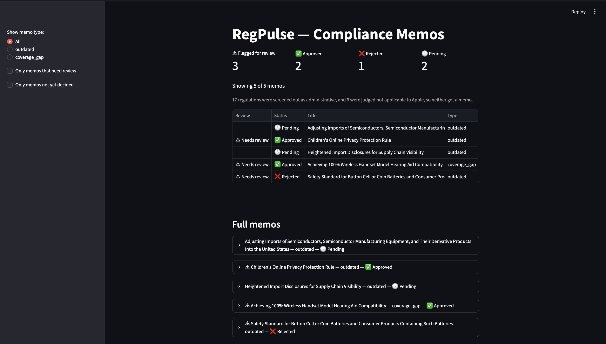
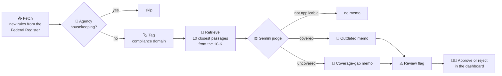
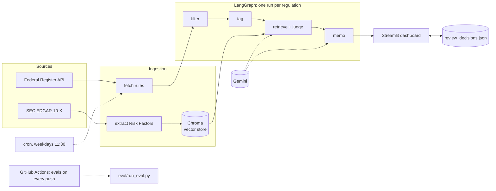
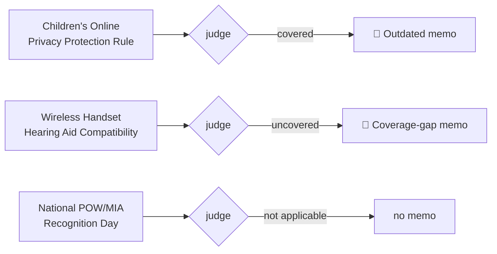
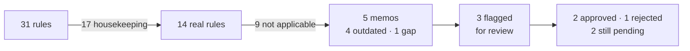
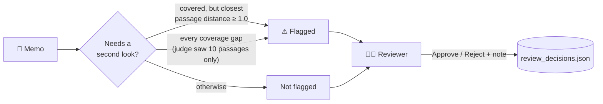
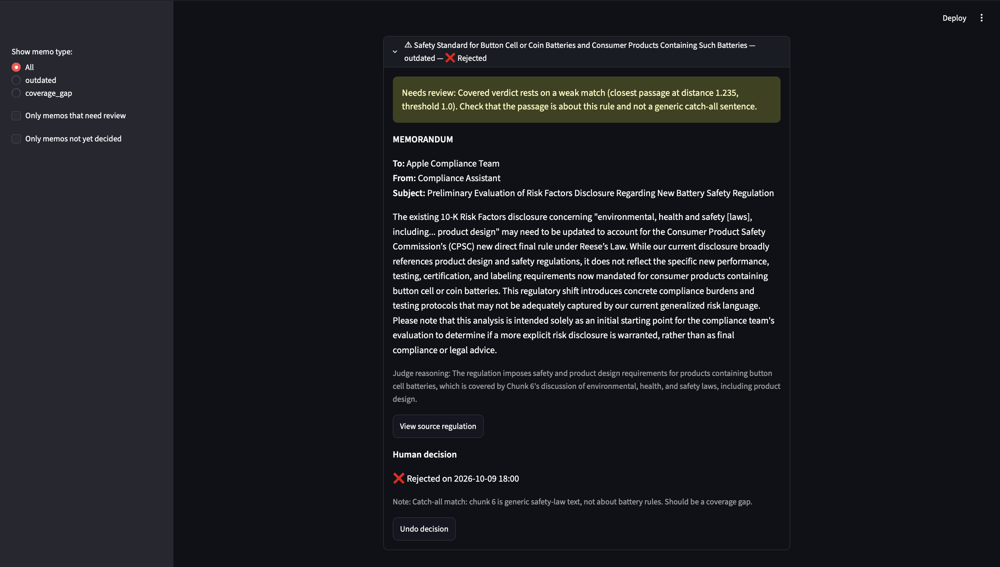
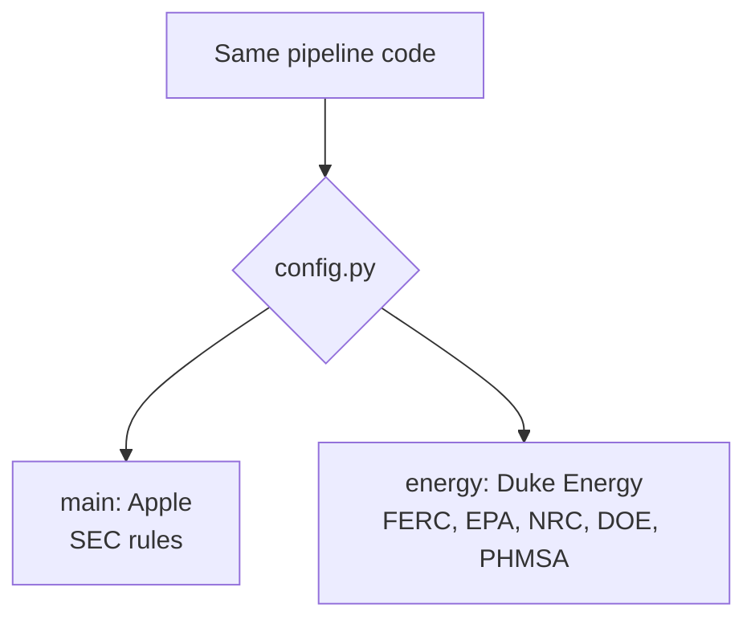

# RegPulse

[](https://github.com/d4t4forge-debugX/regpulse/actions/workflows/eval.yml)


> **You are on the `energy` branch: the Duke Energy version.** Same code as `main`, with Duke's FY2025 10-K and rules from FERC, EPA, NRC, DOE and PHMSA (last 90 days). Its own results are in `graph_results.json` and its gold sets in `eval/`: judge 10/11, filter 21/24, 118 rules, 8 memos, 5 flagged for review. The examples and screenshots below are from the Apple version on [`main`](https://github.com/d4t4forge-debugX/regpulse); section 6 compares the two.

**When a new US regulation is published, RegPulse decides whether it affects a company, checks the company's own risk disclosures, and writes a memo if that wording is now outdated or missing. A person approves or rejects every memo.**



It runs in two versions from the same code: **Apple** against SEC rules (the [`main`](https://github.com/d4t4forge-debugX/regpulse) branch) and **Duke Energy** against FERC, EPA, NRC, DOE and PHMSA rules (this branch, `energy`).

---

## Contents

1. [The problem](#1-the-problem)
2. [How it works](#2-how-it-works)
3. [Three real regulations, three outcomes](#3-three-real-regulations-three-outcomes)
4. [Results](#4-results)
5. [Human review](#5-human-review)
6. [One codebase, two companies](#6-one-codebase-two-companies)
7. [What makes it more than a RAG demo](#7-what-makes-it-more-than-a-rag-demo)
8. [Project structure](#8-project-structure)
9. [Run it](#9-run-it)
10. [Tech stack](#10-tech-stack)
11. [Limitations and possible extensions](#11-limitations-and-possible-extensions)
12. [More detail](#12-more-detail)

---

## 1. The problem

Public companies list their risks in the Risk Factors section of their annual report (the 10-K). When a regulator publishes a new rule, some of that wording can quietly go out of date, or a new obligation may not be mentioned at all.

| | By hand today | With RegPulse |
|---|---|---|
| Finding new rules | Someone reads the Federal Register | Fetched automatically every weekday |
| Does this rule affect us? | A judgement call per rule | An LLM judge decides and writes down why |
| Is it already in our 10-K? | Search the 10-K by hand | The 10 closest passages are retrieved and checked |
| Output | Ad-hoc notes | One memo per affected rule, flagged when the system is unsure |
| Final call | The reviewer | Still the reviewer: approve or reject in the dashboard |

## 2. How it works



| Step | File | What it does |
|---|---|---|
| Fetch | `ingestion/fetch_federal_register.py` | Pulls final rules from the agencies in `config.py` |
| Housekeeping filter | `pipeline/diff_agent.py` | Drops the agency's routine work on itself (technical amendments, delegations, date extensions) |
| Tag | `pipeline/classify_agent.py` | Zero-shot tags the compliance domain, for context only |
| Retrieve | `vectorstore/chroma_store.py` | Finds the 10 Risk Factors passages closest in meaning to the rule |
| Judge | `pipeline/retrieval_agent.py` | Gemini answers two questions **in order**: does this rule materially affect the company? If yes, does any passage already discuss it? |
| Memo | `pipeline/impact_agent.py` | Writes an outdated or coverage-gap memo |
| Review flag | `pipeline/review.py` | Marks memos a person should check first |
| Dashboard | `app/streamlit_app.py` | Shows memos, flags, the judge's reasoning, and approve/reject buttons |

### System structure



<details>
<summary><b>Key terms in plain language</b> (click to open)</summary>

| Term | Meaning |
|---|---|
| **Federal Register** | The US government's daily publication of new rules. It has a free public API. |
| **10-K / Risk Factors** | A public company's annual report, and the section of it that lists business risks. |
| **Embedding** | A list of numbers that captures the meaning of text, so similar texts end up close together. |
| **Chunk** | A 500-character slice of the Risk Factors, so it can be searched piece by piece. |
| **Vector store (Chroma)** | A database that finds the chunks closest in meaning to a query. |
| **RAG** | Retrieval-augmented generation: find relevant text first, then let a language model reason over it. |
| **LLM-as-judge** | Using a language model to make a structured decision, here a three-way verdict. |
| **Distance** | How far apart two embeddings are. Lower means more similar. |
| **Gold set** | Regulations labelled by hand with the right answer, used to score the system. |
| **Confusion matrix** | A grid of right answers against the system's answers; every off-diagonal number is a specific kind of mistake. |

</details>

## 3. Three real regulations, three outcomes



| Regulation | Judge's verdict | Why | Result |
|---|---|---|---|
| **COPPA** (FTC, `2025-05904`) | Covered | Apple's Risk Factors already mention obligations on data about minors | Memo: that wording may need updating for the new amendments |
| **Hearing aid compatibility** (FCC, `2024-25088`) | Uncovered | Every iPhone sold in the US must comply, but the Risk Factors never mention it | Memo: possible gap in the disclosures |
| **POW/MIA Recognition Day** (`2026-19334`) | Not applicable | A ceremonial proclamation with no effect on Apple | No memo |

COPPA is also why the judge exists. Its closest passage sits at distance 1.055, inside the range of irrelevant rules, so a simple distance cut-off would have missed it. The judge read the text and got it right.

## 4. Results

**What happened to Apple's 31 regulations:**



**Scores against hand-labelled gold sets:**

| | Apple (`main`) | Duke Energy (`energy`) |
|---|---|---|
| Judge verdict correct | **11 / 12** | **10 / 11** |
| Housekeeping filter correct | **30 / 31** | **21 / 24** |
| Judge's wrong memo verdicts caught by the review flag | **1 / 1** | **1 / 1** |

Both judge misses are the same known weakness: treating a generic catch-all sentence ("environmental, health and safety laws ... product design") as coverage. They were **reported, not tuned away**, because fitting the prompt to the exact case being graded would make the score meaningless. The labels were committed to git before the pipeline saw each document. Full breakdown, confusion matrices and label corrections: [docs/evaluation.md](docs/evaluation.md).

## 5. Human review

A memo is a starting point, not a decision.



- **Why 1.0:** across both gold sets, the correct "covered" verdicts sat at distances 0.59 to 1.055, and the two wrong ones at 1.007 and 1.235. A cut at 1.0 catches both wrong ones, with one false alarm (COPPA).
- **Why a separate file:** the scheduled pipeline rewrites `graph_results.json`. Human decisions live in their own file, keyed by document number, so a pipeline run can never overwrite a reviewer's decision.



*The button-battery memo above is the judge's known miss. The flag warned that the match was weak, and the reviewer rejected it with the reason: the matched passage is generic safety-law text, not about batteries.*

## 6. One codebase, two companies



Everything company-specific (name, SEC CIK, 10-K files, page-noise pattern, vector-store collection, agencies, domain labels) lives in `config.py`. A second company was a configuration change plus new gold sets.

| | Apple (`main`) | Duke Energy (`energy`) |
|---|---|---|
| Reference filing | FY2025 10-K Risk Factors, 151 chunks | FY2025 10-K Risk Factors, 157 chunks |
| Rules fetched | SEC, last 365 days (+7 hand-added from other agencies for evaluation) | 5 energy regulators, last 90 days |
| Documents | 31 | 118 |
| Housekeeping / not applicable | 17 / 9 | 27 / 83 |
| Memos (flagged) | 5 (3) | 8 (5) |

Why 90 days for Duke: the five regulators published about 480 rules a year, mostly pesticide tolerances and state air plans outside Duke's territory. Each real rule costs one judge call, so the window was cut to keep a run to roughly 100 calls.

## 7. What makes it more than a RAG demo

| What | Why it matters |
|---|---|
| **Three-way judge that asks "does this apply?" before "is it covered?"** | The first version turned every non-match into a coverage-gap memo. Apple memos went from 13 to 5, and every remaining one is for a rule that affects Apple. |
| **Gold sets labelled blind and committed before each run** | The git history shows the labels were not adjusted after seeing the output. |
| **Evaluations run in CI and fail loudly** | GitHub Actions runs them on every push. If any gold document is missing, the evaluation exits with an error instead of printing a score over a partial set. |
| **A review flag with a threshold taken from data** | It catches both known judge misses on two different companies. |
| **Approve/reject decisions stored apart from pipeline output** | Machine output and human decisions never mix. |
| **Label mistakes corrected in the open** | Three Duke labels written from titles were wrong. Each fix carries a note with the original label and the pre-correction score. |
| **Two companies from one config file** | Shows the pipeline is not hard-wired to Apple. |
| **Scheduled, traced and cheap to re-run** | cron on weekdays, LangSmith traces per node, and runs skip finished documents, so a day with no new rules makes 0 Gemini calls. |

Each choice and the evidence behind it: [docs/design_decisions.md](docs/design_decisions.md).

## 8. Project structure

```
Regpulse/
├── config.py                  # everything company-specific
├── ingestion/                 # fetch rules, fetch the 10-K, extract Risk Factors
├── vectorstore/
│   └── chroma_store.py        # builds and queries the vector store
├── pipeline/
│   ├── diff_agent.py          # housekeeping filter
│   ├── classify_agent.py      # domain tagging
│   ├── retrieval_agent.py     # retrieval + three-way Gemini judge
│   ├── impact_agent.py        # memo writing
│   ├── gemini_client.py       # one Gemini client, retries on 503 and 429
│   ├── review.py              # human-review flag
│   ├── decisions.py           # save / load approve-reject decisions
│   ├── graph.py               # LangGraph workflow
│   └── run_graph.py           # batch runner, skips finished documents
├── eval/
│   ├── run_eval.py            # judge and filter evaluations
│   ├── gold_set.json          # 12 labelled regulations (judge)
│   └── gold_set_diff.json     # 31 labelled regulations (filter)
├── app/streamlit_app.py       # dashboard
├── scripts/run_pipeline.sh    # fetch, then graph (used by cron)
├── docs/                      # detailed write-ups and screenshots
├── graph_results.json         # pipeline output
└── review_decisions.json      # human decisions
```

## 9. Run it

```bash
git clone https://github.com/d4t4forge-debugX/regpulse.git
cd regpulse
python3 -m venv .venv && source .venv/bin/activate
pip install -r requirements.txt
cp .env.example .env                  # add your GEMINI_API_KEY

python -m vectorstore.chroma_store    # build the vector store, once
./scripts/run_pipeline.sh             # fetch, then run the graph
streamlit run app/streamlit_app.py    # open the dashboard
python -m eval.run_eval               # judge evaluation (0 Gemini calls)
python -m eval.run_eval --diff        # filter evaluation (0 Gemini calls)
```

Setup details, scheduling with cron, cost and a production mapping: [docs/setup_and_operations.md](docs/setup_and_operations.md).

## 10. Tech stack

| Purpose | Tool |
|---|---|
| Judge and memos | Gemini API (`gemini-3.5-flash`), `temperature=0` |
| Orchestration | LangGraph |
| Embeddings | sentence-transformers `all-MiniLM-L6-v2` (local) |
| Vector store | Chroma (local) |
| Domain tagging | Hugging Face `facebook/bart-large-mnli`, zero-shot |
| Dashboard | Streamlit |
| Tracing | LangSmith |
| Scheduling / CI | cron / GitHub Actions |
| Data | Federal Register API, SEC EDGAR |

## 11. Limitations and possible extensions

**Known limitations**

- The judge can treat a generic catch-all sentence as coverage. The review flag catches the known cases, but the prompt itself is not fixed.
- The judge sees only the 10 closest passages, so a claimed gap may be covered elsewhere in the 10-K. Every gap is flagged for that reason.
- The gold sets are small (12 and 11 judge examples), so the scores carry wide uncertainty.
- The Apple version fetches SEC rules only; the 7 other-agency documents were added by hand.
- cron does not run while the Mac is asleep, and does not catch up.
- Memo quality is read by hand, not scored.

**Possible extensions**

- A prompt rule for catch-all text, tested only on newly labelled blind cases.
- Larger gold sets, labelled from abstracts before the pipeline runs.
- Fetching from every agency that can affect the company.
- Docker packaging and a cloud scheduler.
- Visual retrieval for scanned or table-heavy filings. A ColQwen2 experiment was built and parked; the reasons are in the design notes.

## 12. More detail

| Document | What's in it |
|---|---|
| [docs/executive_summary.md](docs/executive_summary.md) | One page: problem, users, results, risks |
| [docs/evaluation.md](docs/evaluation.md) | Full scores, confusion matrix, every miss, label corrections, risk notes |
| [docs/design_decisions.md](docs/design_decisions.md) | Each design choice with its evidence, retrieval design, lessons learned |
| [docs/setup_and_operations.md](docs/setup_and_operations.md) | Full setup, running, scheduling, cost, production mapping |

## License

MIT. See [LICENSE](LICENSE).
