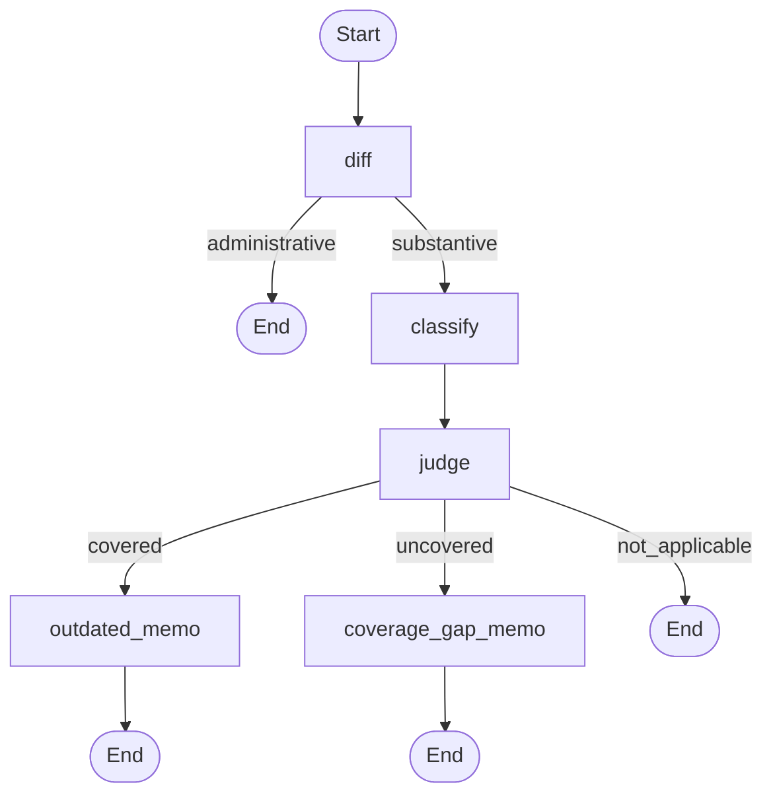
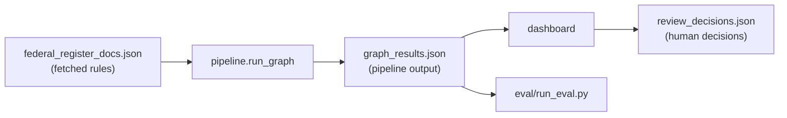

# Design decisions and lessons

[← Back to README](../README.md)

Each choice below is backed by something that actually happened in the project.

## Retrieval design

The Risk Factors text is split into **500-character chunks with a 50-character overlap**, embedded with `all-MiniLM-L6-v2`, and stored in a local Chroma collection (151 chunks for Apple). For each regulation, the title and abstract become the query. The **10 closest chunks** go to the Gemini judge, which returns:

- `verdict`: `covered`, `uncovered` or `not_applicable`
- `relevant_chunk_number`: which of the 10 chunks it relied on (only for `covered`)
- `reasoning`: a short explanation

## The orchestration graph

Each regulation runs through the LangGraph graph once. The loop over regulations sits outside the graph (`pipeline/run_graph.py`), which keeps skipping finished documents and saving after each one simple.

The zero-shot classifier and the embedding model are loaded once and reused for every regulation, not reloaded per document.

## Data flow and keys

Every data file is keyed by the Federal Register `document_number`, and every save **merges** into the existing file by that key. Nothing is overwritten wholesale, so no run can shrink a file another step depends on.

## Decisions

**Decide applicability before coverage.** The first judge answered only "is any passage relevant?", and every "no" became a coverage-gap memo. That produced memos for rules that have nothing to do with Apple, such as a POW/MIA proclamation and EDGAR filing-manual updates: 10 of 13 memos. The judge now returns three verdicts, and its prompt asks "does this materially affect Apple?" **before** "is it covered?". When the prompt only listed the three definitions, the hard BIS export-control case still came back `covered`, because Apple's trade risk factor mentions export controls. Ordering the two questions fixed it ("Apple is not a manufacturer or exporter of these enterprise AI chips") without breaking the real `covered` cases. Memos went from 13 to 5.

**An LLM judge instead of a distance threshold.** The obvious approach is "if the closest chunk is within X, call it relevant". It failed: the closest irrelevant regulation scored nearer than a relevant one, and COPPA landed inside the irrelevant range. No single cut-off separates the classes, so the judge decides from meaning.

**Human decisions in their own file.** The scheduled pipeline rewrites `graph_results.json`. Approve/reject decisions are saved to `review_decisions.json`, keyed by `document_number`, through `pipeline/decisions.py`. The pipeline never reads or writes that file, so a run can never overwrite a reviewer's decision.

**A written rule for the housekeeping filter.** Administrative means the agency's routine work on itself: its own procedures, staff delegations, forms, filing system and dates. Everything else is substantive, even if it has nothing to do with the company, because applicability is the judge's job. The keyword list follows that rule. It is not stretched to catch one-off titles just to raise the score.

**`temperature=0` on the judge.** The hardest positive case (customs import disclosures) returned true on one run and false on the next with identical input. Setting the temperature to 0 made the verdict stable, and later reruns matched.

**Official metadata only.** Two documents once carried hand-paraphrased abstracts instead of the official text. They were replaced with the Federal Register's own metadata, and `ingestion/refresh_documents.py` re-fetches any document by number when its data is in doubt.

**Title-only fallback for missing abstracts.** In an unlabelled sample of 20 real documents, 7 (35%) had no abstract. Skipping them would have hidden a whole category of documents, such as presidential proclamations, some of which matter. The pipeline uses the title instead.

**Merge by key everywhere.** An early version overwrote data files on each run. That silently shrank three files and dropped documents the fetch step could not return again. Every save now loads, merges by `document_number`, and writes.

**One pipeline, one config file.** An older run-each-script-by-hand path wrote its own output files alongside the LangGraph runner. It was removed, so cron runs exactly two steps (fetch, then the graph). Company-specific values live in `config.py`.

**Text retrieval only, ColQwen2 parked.** A visual retriever (ColQwen2) was built and tested as a second source. It ranked the right pages highly, but page-level retrieval over the 12 risk-factor pages is coarse: a few "hub" pages filled most top-3 slots for every query, relevant or not, and its scores cannot be compared across queries or against text distances. It also can only rank, so it cannot say "nothing is relevant". It stays a standalone experiment (`vectorstore/colpali_store.py`, `eval/colpali_*.py`), working from a frozen snapshot in `federal_register_retrieval.json`.

**One model per verdict.** A cheaper Gemini variant got the hard BIS case wrong where the full model got it right. The pipeline does not route documents to whichever model has quota left, because that would make verdicts depend on timing instead of content.

**cron for scheduling.** cron is built into macOS and needs no long-running process, unlike a Python scheduler library.

## Lessons learned

- **Check what the evaluation actually reads.** The judge evaluation once scored a stale side file instead of the pipeline's real output, so a perfect score said nothing about the system in use.
- **"Not relevant" is not the same as "missing".** Treating every non-match as a coverage gap filled the dashboard with memos about rules that do not apply.
- **A 100% score is a prompt to stress-test.** An empty row in the confusion matrix meant a whole path was untested.
- **Do not tune on the example you are grading.** A known miss, explained, is worth more than a score bought by fitting the prompt to one case.
- **Label from the abstract, never the title.** Three Duke labels written from titles were wrong; one of them was a case the judge got right.
- **Check where every data field came from.** Two abstracts in the corpus were paraphrases, not official text.
- **Merge by key, never overwrite.** Three overwrite-style saves once silently shrank data files.
- **Fail loudly, not partially.** A score printed over a partial set is worse than an error.
- **Pin `temperature=0` on judges.** Otherwise borderline verdicts can flip between runs.
- **Real data has missing fields.** About a third of unlabelled documents had no abstract, and a fallback beat skipping them.
- **A model name is not a billing status.** A long stretch of quota errors was a closed billing account, not a code bug.
- **Failed retries still count against quota.** More retries can hit the daily limit faster.
- **Save progress incrementally** in long LLM runs, so a failure does not lose finished work.
- **cron has its own environment and its own OS permissions.**
- **Verify the notes against the files.** Project notes go stale; always check the real state.
