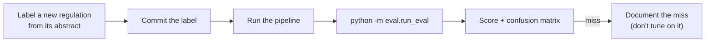

# Evaluation

[← Back to README](../README.md)

Two evaluations run from `eval/run_eval.py`, each against hand-labelled gold sets. Labels are written and committed **before** the pipeline sees a new document, so the git history shows they were not adjusted after the fact. GitHub Actions runs both on every push.



## Scores

| Evaluation | Tests | Apple (`main`) | Duke Energy (`energy`) | Gemini cost |
|---|---|---|---|---|
| Judge | Is the three-way verdict right? | **11/12** (3 covered, 2 uncovered, 7 not applicable) | **10/11** (2 covered, 1 uncovered, 8 not applicable) | 0 by default; `--rerun` calls Gemini |
| Housekeeping filter (diff) | Administrative or substantive? | **30/31** | **21/24** | 0 |
| Review flag | Does it catch the judge's wrong memo verdicts? | 1 of 1 caught | 1 of 1 caught | 0 |

```
python -m eval.run_eval              # judge evaluation on saved results
python -m eval.run_eval --rerun      # re-run the judge on the gold set (uses Gemini)
python -m eval.run_eval --diff       # housekeeping-filter evaluation
```

### Apple confusion matrix

Rows are the right answers, columns are the judge's answers.

```
                         covered       uncovered  not_applicable
covered                        3               0               0
uncovered                      1               1               0
not_applicable                 0               0               7
```

## The review flag, measured

`pipeline/review.py` flags (1) `covered` verdicts whose closest passage is at distance 1.0 or more, and (2) every `uncovered` verdict.

**Where the 1.0 comes from.** Across both gold sets, the correct `covered` verdicts had distances 0.59, 0.729, 0.837, 0.846 and 1.055; the two wrong ones (button batteries for Apple, Title V permits for Duke) had 1.235 and 1.007. A cut at 1.0 catches both wrong ones and flags one correct one (COPPA). No cut catches both without that false alarm.

| | Wrong memo verdicts caught | Correct memo verdicts also flagged |
|---|---|---|
| Apple gold set | 1 of 1 | 2 of 4 (COPPA by distance; the hearing-aid gap, as every gap is) |
| Duke gold set | 1 of 1 | 0 of 2 |

The flag is cautious on purpose. Sending a correct memo for a second look costs a reviewer a few minutes; acting on a wrong one means a disclosure decision based on the wrong passage. The threshold was set on the same small gold sets it is measured on, so these hit rates are optimistic until new cases are labelled.

## Apple misses, and why they were not "fixed"

- **Judge: button-battery products** (`2023-20333`, CPSC). It applies to AirTag, and the Risk Factors never mention button or coin batteries, so it was labelled `uncovered`. The judge called it `covered`, pointing at a generic catch-all line ("environmental, health and safety, including ... product design and climate change"). This was predicted as a hard case before the run. The impact is small, because both verdicts produce a memo, and the review flag catches it. Tuning the prompt against this exact example would make the score meaningless; a fix needs new blind-labelled cases to test against.
- **Filter: Commission Quorum Requirement** (`2026-20262`). It is SEC housekeeping on its own voting rules, so it was labelled administrative. No phrase in the list catches it, and adding "Quorum" would match only this one document. It reaches the judge, which correctly returns `not_applicable`, so it costs one Gemini call and produces no memo.

## Duke Energy misses and corrections

- **Judge: Title V "applicable requirements"** (`2026-19671`). Every Duke plant holds a Title V permit and the Risk Factors only say "a wide variety of environmental licenses, permits", so it was labelled `uncovered`; the judge called it `covered`. It is the same catch-all failure as the Apple button-battery case, on a second company, and the review flag catches it.
- **Three labels were corrected after the run, openly.** They had been written from document titles. The abstracts showed CSAPR `2026-20191` applies only to Virginia units (the judge's `not_applicable` was right; the label said `uncovered`), and two PHMSA "Standards Update" documents were effective-date confirmations of rules published months earlier, which are housekeeping. Each corrected entry carries a note with the original label. Before correction the scores were judge 10/12 and filter 20/24.
- **Filter: three one-off housekeeping titles** (an NRC procedure rule, a South Carolina agency name change, an RFS reporting-deadline extension) are missed. Two general Federal Register phrases were added instead ("confirming the effective date", "Compliance Date Extension"), which also removed 13 duplicate memos about pipeline-standards confirmations.

## How much to trust these numbers

- A perfect score is treated as a prompt to stress-test, not as proof. The judge first scored 10/10 with no `uncovered` example in the gold set at all, which tested nothing about the coverage-gap path. Two blind-labelled `uncovered` cases were added, and one of them failed.
- The gold set includes deliberately hard cases: BIS license review (topically close to a real risk factor, but not applicable), the CBP customs disclosure (covered, with no tariff vocabulary), and the button-battery rule (generic catch-all text nearby).
- 12 and 11 judge examples are small sets, with one or two `uncovered` cases each. Several labels are marked borderline or hard in the files.

**Evaluations fail loudly.** If any gold document is missing from the data, or was judged before the three-way judge existed, the evaluation lists every affected document and exits with code 1. It never prints a score over a partial or outdated set. This came from a real bug: a damaged data file once made the filter evaluation print 62.96% over skipped examples.

## Risk notes

| Risk | Seen where | What handles it |
|---|---|---|
| The judge treats a generic catch-all sentence as coverage | Apple button batteries, Duke Title V | Review flag (distance ≥ 1.0) and human rejection; a prompt fix needs new blind-labelled cases first |
| The judge only sees the 10 closest passages, so a gap may be covered elsewhere | Every `uncovered` verdict | Review flag on every gap; the memo says only the closest passages were checked |
| Keyword filter misses one-off housekeeping titles | SEC Quorum rule; NRC procedure, SC name change, RFS deadline | They reach the judge, which returns `not_applicable` (one Gemini call, no memo) |
| Verdicts flipped between runs on borderline cases | CBP customs disclosure (Apple) | `temperature=0` for the judge and memos |
| Documents with no abstract crashed the pipeline | 35% of an unlabelled sample | Title-only fallback |
| Gold labels written from titles can be wrong | 3 Duke labels | Label from the abstract; corrections carry a note with the original label |
| A memo can overstate impact or go beyond the abstract | Read by hand | Human approve/reject; memo quality is not scored |
| cron misses runs when the Mac is asleep or off | Several mornings | Known limitation; a cloud scheduler in production |
| Small gold sets give wide uncertainty | Both versions | Stated next to every score |
